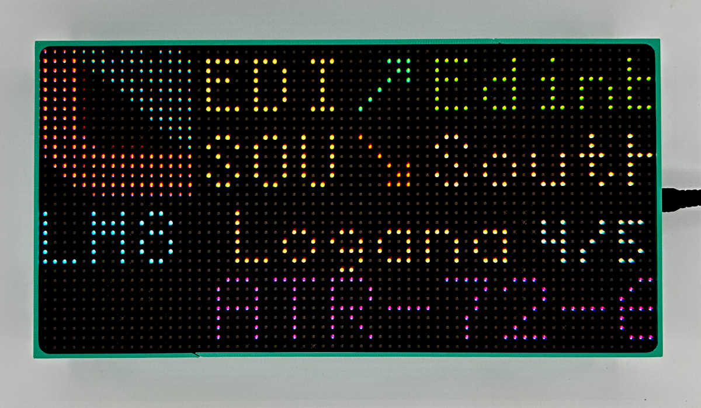
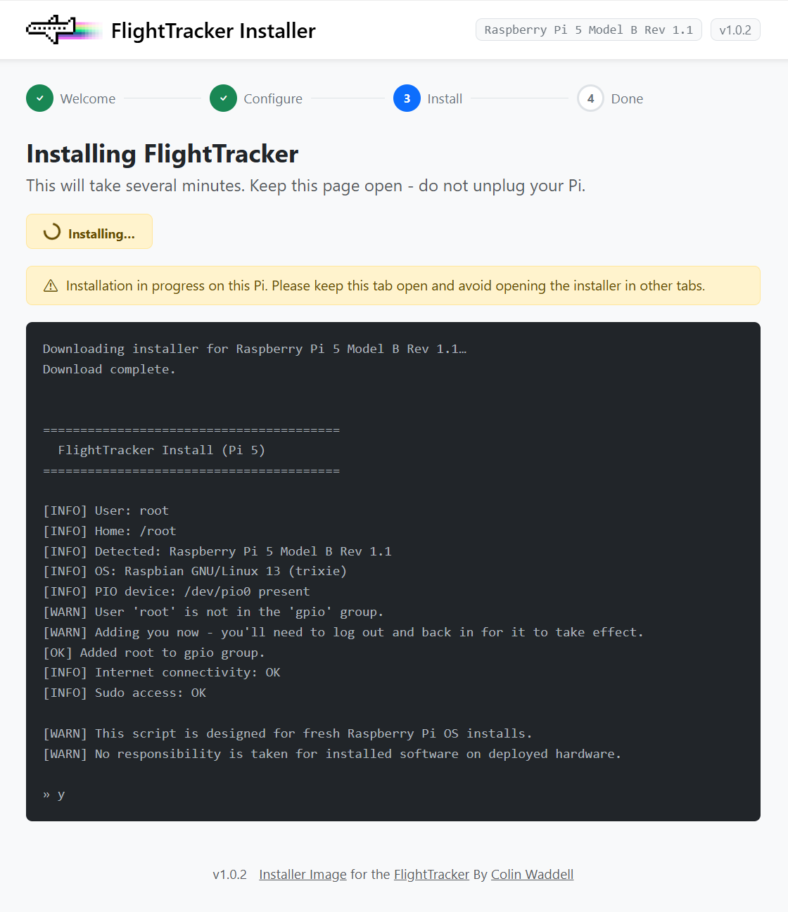

# FlightTracker OS

A pre-built Raspberry Pi image with everything installed and configured for your own [Flight Tracker](https://flight-tracker.dev). No command-line required.



## What is this?

[Flight Tracker](https://flight-tracker.dev) is a Raspberry Pi-powered RGB LED matrix that shows you what aircraft and satellites are overhead. It takes live aircraft data, works out what is nearby, and displays it on a 64×32 RGB LED matrix. When there is nothing overhead, it can show the time, weather, temperature, rainfall, or satellite passes.

**FlightTracker OS** is the easiest way to get it running. Flash the image to an SD card with [Raspberry Pi Imager](https://www.raspberrypi.com/software/), set your Wi-Fi details, flash, and boot. You can then log into the web installer and finish setup from your browser.

32-bit and 64-bit images are available for every Raspberry Pi model, from the Pi Zero up to the Pi 5.

## Install with Raspberry Pi Imager

If you have [Raspberry Pi Imager](https://www.raspberrypi.com/software/) installed, you can open the FlightTracker OS image directly [BY CLICKING HERE](rpi-imager://open?repo=https%3A%2F%2Fraw.githubusercontent.com%2FColinWaddell%2FFlightTracker-Image%2Frefs%2Fheads%2Fmain%2Fos_list.json)

> RPi Imager will ask you to confirm the custom repository before loading it.

If the button above doesn't work, open RPi Imager and add this URL manually under **App Options → Content Repository → Custom URL**:

```
https://raw.githubusercontent.com/ColinWaddell/FlightTracker-Image/refs/heads/main/os_list.json
```

## How it works

1. **Flash the image** - Either [click this link](rpi-imager://open?repo=https%3A%2F%2Fraw.githubusercontent.com%2FColinWaddell%2FFlightTracker-Image%2Frefs%2Fheads%2Fmain%2Fos_list.json) or open RPi Imager, paste the URL above, set your Wi-Fi in Advanced Options, then flash to an SD card.
2. **Boot your Pi** - Insert the card and power on. The Pi connects to your Wi-Fi automatically using the credentials you set.
3. **Open the installer** - Visit `http://flighttracker.local/:8584` in your browser (tweak the URL based on the hostname you gave the device). The web installer guides you through the rest.
4. **Reboot and enjoy** - Hit Reboot when the installer finishes. FlightTracker starts automatically on the LED display.



## Which image should I choose?

| | 64-bit (`arm64`) | 32-bit (`armhf`) |
|---|---|---|
| **Best for** | Pi Zero 2 W, Pi 3, Pi 4, Pi 5 | Pi Zero, Pi Zero W |
| **Notes** | Recommended - best performance | Use for older boards or 32-bit library compatibility |
| **Download** | [`flighttracker-os-arm64.img.xz`](https://github.com/ColinWaddell/FlightTracker-Image/releases/latest/download/flighttracker-os-arm64.img.xz) | [`flighttracker-os-armhf.img.xz`](https://github.com/ColinWaddell/FlightTracker-Image/releases/latest/download/flighttracker-os-armhf.img.xz) |

Pre-built images are also available on the [releases page](https://github.com/ColinWaddell/FlightTracker-Image/releases).

## Build your own

Want to build the hardware? An [official 3D-printable case](https://www.printables.com/model/1820229-flight-tracker-screen-for-raspberry-pi-any-model-6) is available, and full build instructions are on the [FlightTracker site](https://github.com/ColinWaddell/FlightTracker).

---

Full details and more are available on the official website [Flight-Tracker.dev](https://flight-tracker.dev)